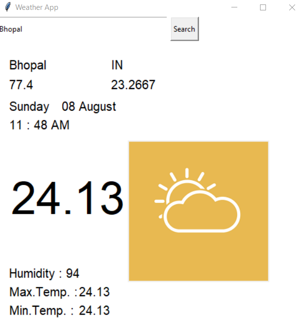

# 📋 WEATHER APPLICATION

## 📌 Steps To Run the Code

* On the [GitHub page for this repository](https://github.com/rishabhrathore055/Weather_App_Using_python), click on
the Button "Fork".

* Create clone your forked repository on your local machine.

For example, run this Command inside your Git bash or terminal:
```
git clone https://github.com/<your-github-username>Weather_App_Using_python.git
````
* Open Code Folder in Python IDEs
<br>

###### for exaple,Visual Studio Code, Sublime Text ,Atom etc.
* install Respective Python libraries
```
pip install tkinter
pip install requests
```
### Then You have generate Your Own API key
* Login in the [Open Weather Map](https://openweathermap.org/)
* Go to the API section. Then in the Current Weather Data section click on the API Document
* Now in the API Call section,You to link Your own api to code
```
api.openweathermap.org/data/2.5/weather?q={city name}&appid={API key}
```
* Then run the Code

## Output!:


## Team Details
### Rishabh Rathore 
* [Linkinden](https://www.linkedin.com/in/rishabhrathore)
* [Github](https://github.com/Rishabhrathore055)
### Rohit Akilaysh Vanne 
* [Linkinden](https://www.linkedin.com/in/rohit-akilaysh-vanne/)
* [Github](https://github.com/RohitVanne)

